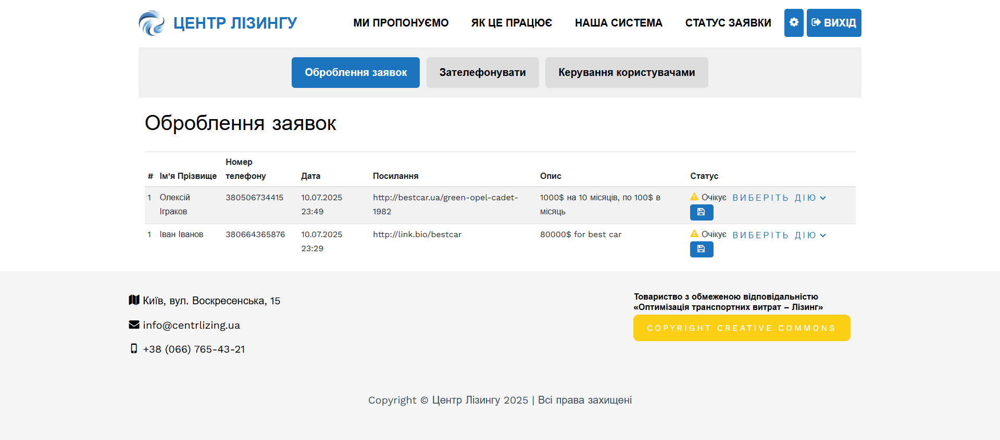

# 🚗 Leasing Center


**Leasing Center** is a modern web platform that provides financial leasing services for automobile purchases. It is designed for both administrators and customers, offering complete workflows from request submission to order management.

---

## 🔐 System Overview

### 👤 User Features

- **Registration & Login** – Secure user registration and authorization system.
- **Apply for Leasing** – Users can submit leasing applications with personal and vehicle data.
- **"Call Me Back" Feature** – Users can request a callback by submitting their phone number.
- **Application Status Check** – Users can track the current status of their submitted applications.

### 🖠️ Admin Features

- **User Account Management** – Admins can manage accounts: log in, log out, and delete users.
- **Order Management** – Admin panel for processing leasing requests.
- **Call Requests Handling** – Admins can view and manage callback requests from users.

---


---

## ⚙️ Configuration & Technologies

### 🔧 Server & Language Stack

- **Apache** 2.4
- **PHP** 8.0
- **MySQL** 8.0
- **HTML** 5
- **CSS** 3
- **jQuery** 3.3.1

### 🎨 Frontend Frameworks

- **Bootstrap** 4.3.1
- **AOS** (Animate On Scroll) for animations

---

## 📁 Project Structure

```
project-root/
│
├── assets/
│   ├── css/
│   ├── fonts/
│   ├── images/
│   └── js/
│
├── backups/
│   └── centralizing-11-07-2025.sql          # Database backup
│
├── config/
│   └── db.php                              # Database connection
│   └── routes.php                          # Route configuration
│
├── incs/
│   ├── handlers/                           # Query handlers (e.g. update_order_status_handler.php)
│   └── templates/                          # Page components (header, footer, etc.)
│
├── src/
│   ├── Controllers/
│   ├── Router.php
│   └── Services/
│
├── views/
│   └── site/                               # Public-facing pages (home, about, etc.)
│
├── .htaccess                               # Apache server configuration
├── index.php                               # Application entry point
├── composer.json, composer.lock            # PHP dependency configuration
├── robots.txt, sitemap.xml                 # SEO modules
```

---

## 🚀 Getting Started

1. Clone the repository:

   ```bash
   git clone https://github.com/poddfonarem/centrlizing.git
   ```

2. Import the database:

   - Use `backups/centrlizing-11-07-2025.sql` to restore the database.

3. Configure database connection:

   - Edit `config/db.php` with your DB credentials.

4. Set up virtual host or use `localhost/index.php` to launch.

---

## 📸 Screenshots




---

## 📜 License

This project is for academic or demo purposes. All rights reserved © 2025.

